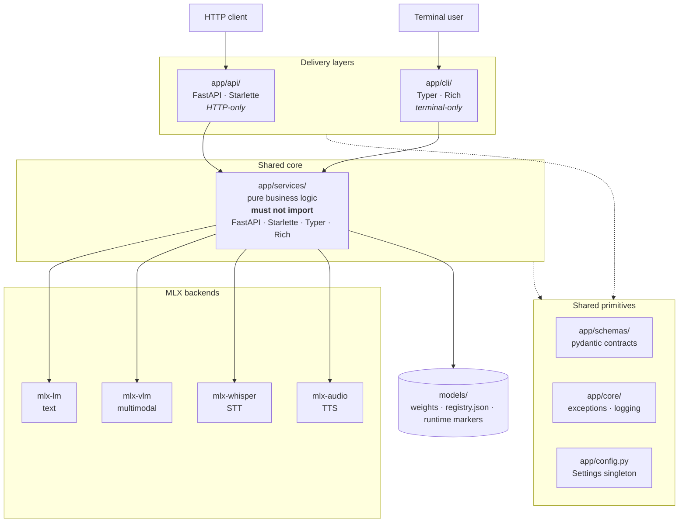
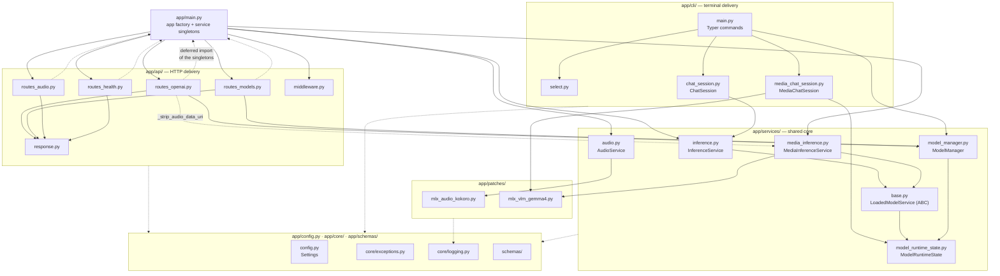
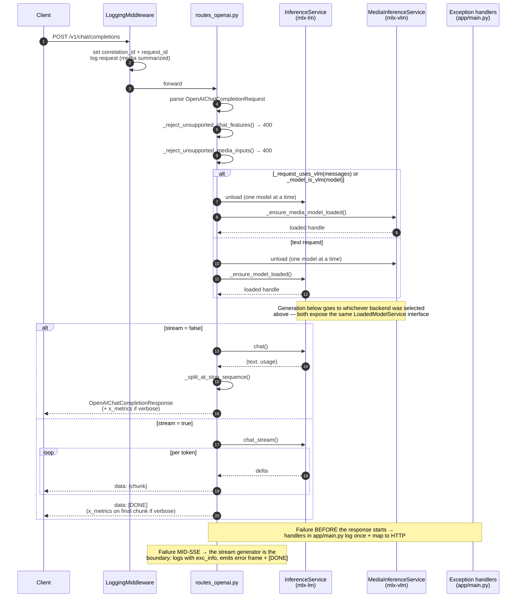
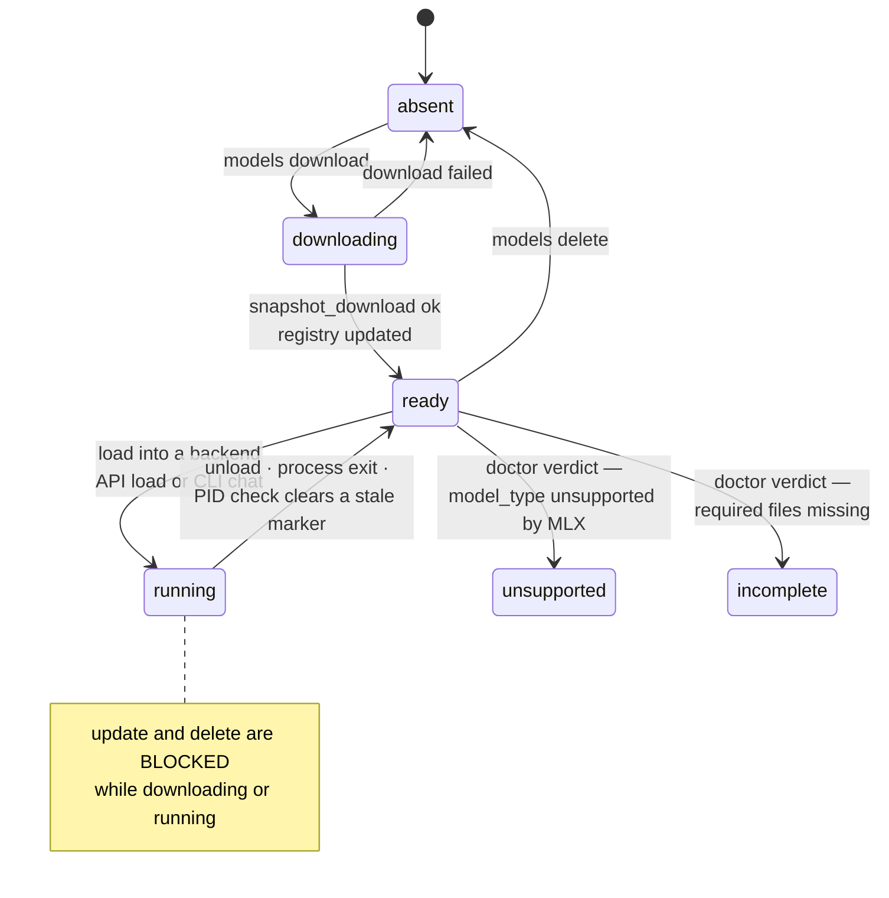
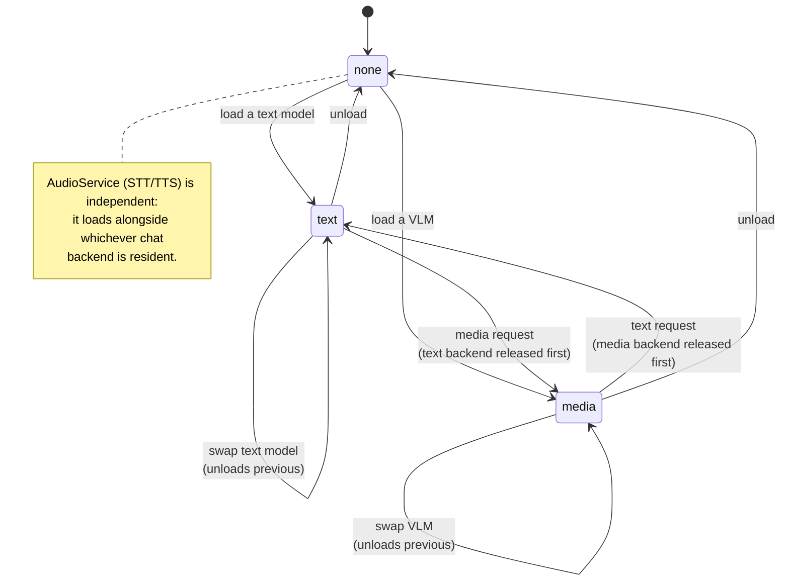

# System Design

Diagrams only. For the written breakdown — directory map, naming conventions, and
what each component does — see [structure.md](structure.md).

## Layers

Two delivery mechanisms over one framework-free service core.

## Module dependency graph

Who imports whom inside `app/`. Every module also imports from
`app/config.py` + `app/core/` (and most from `app/schemas/`); those edges are
aggregated as the dotted lines at the bottom to keep the graph readable.

`MediaChatSession` is deliberately **not** wired to `MediaInferenceService`: it
imports `mlx_vlm` directly via `importlib` and manages its own runtime marker.
Only the HTTP path uses `MediaInferenceService`.

## Request flow — `POST /v1/chat/completions`

## Model lifecycle

States are visible across processes via marker files in `models/runtime/`.

## Backend mutual exclusion

Loading into one backend releases the other — limited unified memory.

